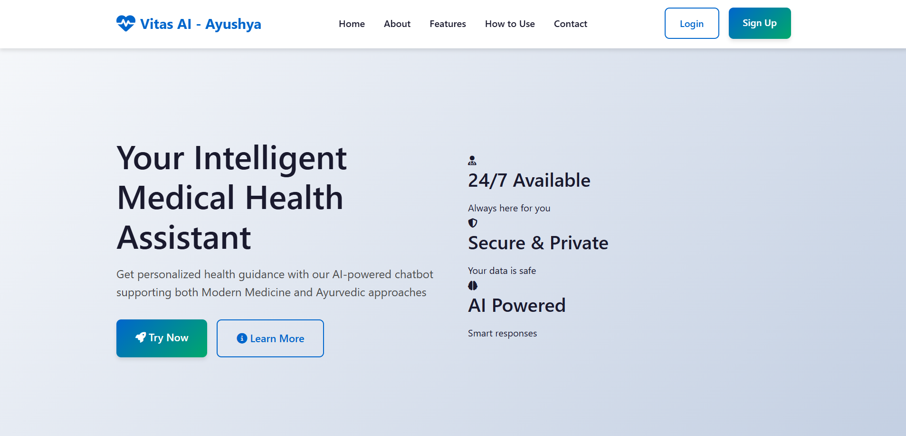
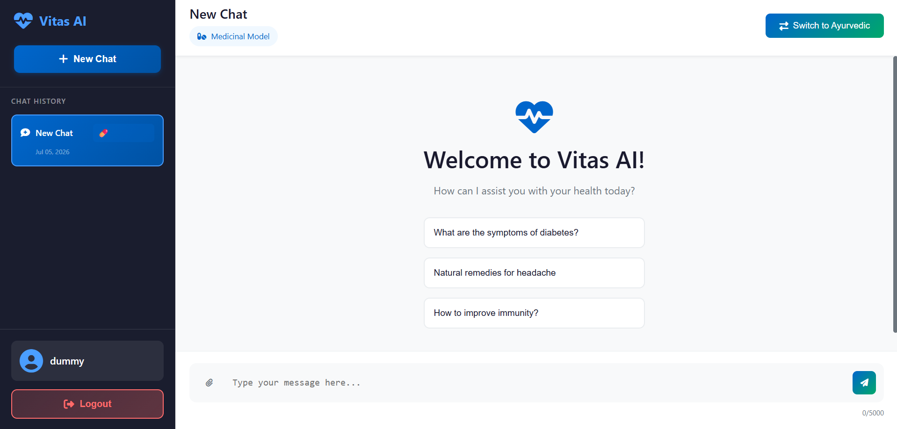
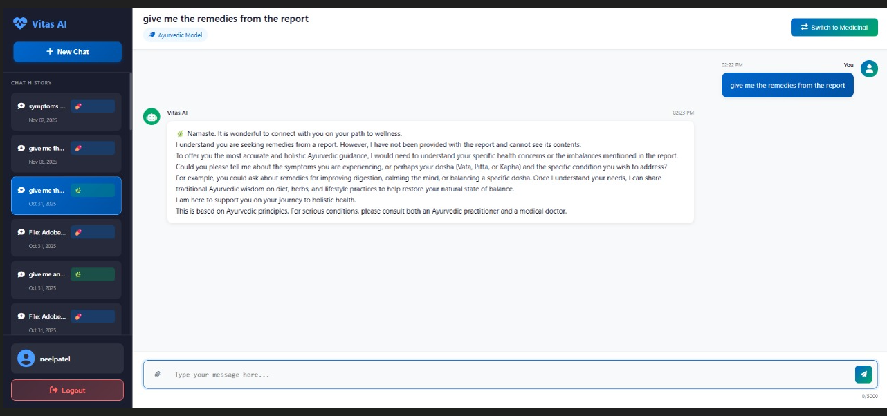
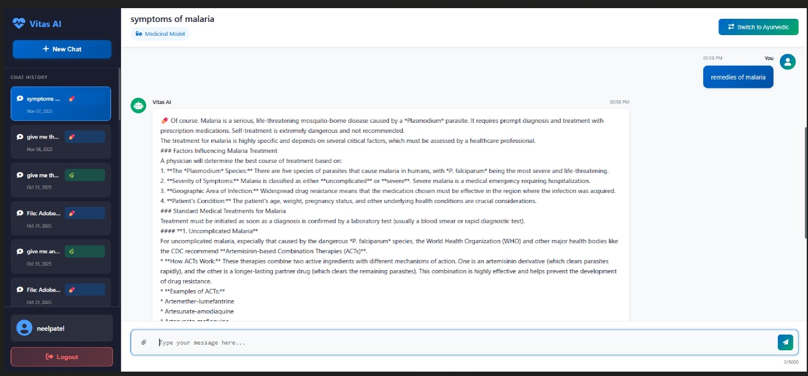
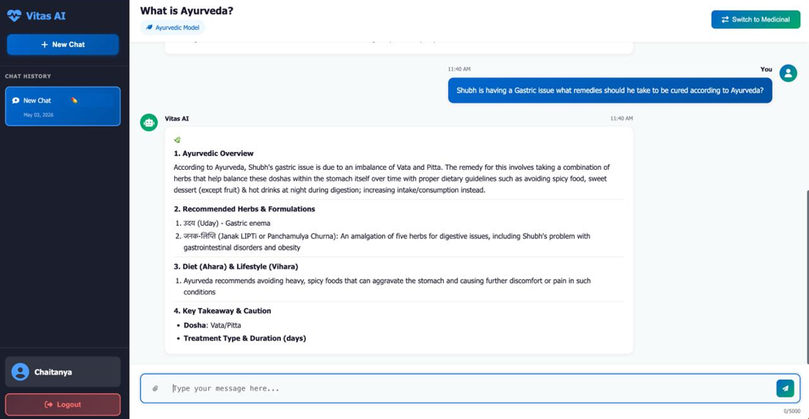
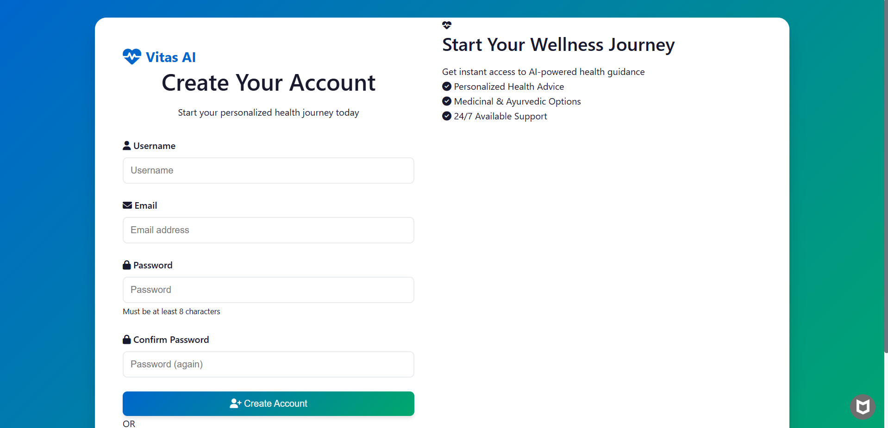
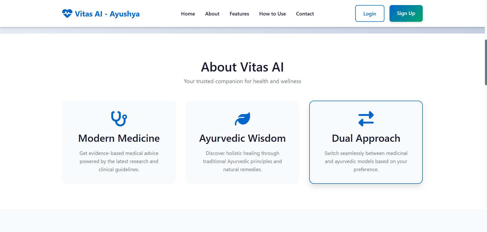

# 🌿 Vitas AI — Medical & Ayurvedic Chatbot

<p align="center">


</p>

> **Vitas AI** is an intelligent health assistant that combines two specialized AI models — a **Medical AI** for evidence-based clinical answers and an **Ayurvedic AI** fine-tuned on classical Ayurvedic texts — into a single Django-powered web application.

---

## ✨ Features

- 🩺 **Medical Mode** — Board-level clinical answers (Pathophysiology, Diagnosis, Management, USMLE-style)
- 🌿 **Ayurvedic Mode** — Dosha analysis, herbal formulations, Dinacharya, Sanskrit terms with explanations
- 📄 **RAG Document Analysis** — Upload PDFs/images; the system retrieves the most relevant chunks via ChromaDB and grounds the AI's answer in your document
- 🔗 **Groq API** — High-speed inference for document-grounded queries (Llama 3.3 70B)
- 🖥️ **100% Local Models** — Both GGUF models run locally on Apple Silicon (M2 Metal GPU) via `llama-cpp-python`
- 👤 **User Auth** — Django Allauth with Google OAuth support
- 💬 **Conversation History** — PostgreSQL-backed chat history per user

---

# 📸 Screenshots

## 🏠 Home Page
The landing page of **Vitas AI**, providing access to Medical AI, Ayurvedic AI, and core platform features.

<p align="center">
  
</p>

---

## 💬 Chat Window
Interactive chat interface supporting real-time conversations with the AI assistant.

<p align="center">
  
</p>

---

## 🌿 Ayurvedic Chatbot
Provides Ayurvedic diagnosis, dosha analysis, herbal formulations, diet recommendations, and lifestyle guidance.

<p align="center">
  
</p>

---

## 🩺 Medical Chatbot
Evidence-based medical assistant capable of answering clinical and healthcare-related questions.

<p align="center">
  
</p>

---

## 📄 Details Page
Displays additional information, chatbot capabilities, and system details.

<p align="center">
  
</p>

---

## 🔐 Login Page
Secure user authentication with Django Allauth and Google OAuth integration.

<p align="center">
  
</p>

---

## ℹ️ About Page
Overview of the Vitas AI project, objectives, and technology stack.

<p align="center">
  
</p>

---

## 🏗️ Architecture

```
User Browser
     │
     ▼
Django (chatbot app)
     │
     ├── views.py ──────────────────► ai_models.py  (Router)
     │                                    │
     │                            ┌───────┴────────┐
     │                            ▼                ▼
     │                    phi3_model.py     medical_model.py
     │                    (Ayurveda GGUF)   (Medical GGUF)
     │                            │
     │                            ▼
     │                    rag_engine.py  ◄── ChromaDB (rag_storage/)
     │                            │
     │                    [Document uploaded?]
     │                            │ YES
     │                            ▼
     │                    Groq API  (Llama 3.3-70B)
     │
     └── PostgreSQL  (users, conversations, messages, files)
```

---

## 🤖 HuggingFace Models

| Model | HuggingFace Repo | Size | Purpose |
|-------|-----------------|------|---------|
| Ayurveda Phi-3 | [`Shubh769/Vitas-Ayurveda-Phi3`](https://huggingface.co/Shubh769/Vitas-Ayurveda-Phi3) | ~2.7 GB | Fine-tuned on classical Ayurvedic texts, herbs, doshas |
| Medical Phi-3 | [`Shubh769/medical_phi3_q4km.gguf`](https://huggingface.co/Shubh769/medical_phi3_q4km.gguf) | ~2.4 GB | Trained on NIH MedQuad, USMLE MedQA, WikiDoc, PubMed |

Both models are in **Q4_K_M GGUF format** and are downloaded automatically on first use by `llama-cpp-python`.

**Training Results (Ayurveda Model):**
- ROUGE-1: `0.4257` | ROUGE-2: `0.2116` | ROUGE-L: `0.3379`
- Mean Perplexity: `9.49`

---

## 🚀 Setup

### Prerequisites
- Python 3.11+
- PostgreSQL
- Apple Silicon Mac (M1/M2) or CUDA GPU recommended

### 1. Clone & Install

```bash
git clone https://github.com/yugsgithub/Vitas-Ai.git
cd Vitas_ai
pip install -r requirements.txt
pip install llama-cpp-python  # for local model inference
pip install groq chromadb sentence-transformers PyPDF2 pytesseract
```

### 2. Environment Variables

Create a `.env` file in the project root:

```env
GEMINI_API_KEY=your_gemini_key_here
GROQ_API_KEY=your_groq_key_here

# PostgreSQL
DB_NAME=vitas_db
DB_USER=vitas_user
DB_PASSWORD=your_password
DB_HOST=localhost
DB_PORT=5432
```

### 3. Database Setup

```bash
# Create PostgreSQL database
createdb vitas_db
createuser vitas_user

# Run migrations
python manage.py migrate
python manage.py createsuperuser
```

### 4. Run

```bash
python manage.py runserver
```

Visit: `http://127.0.0.1:8000`

---

## 📁 Project Structure

```
Vitas_ai/
├── chatbot/                  # Main Django app
│   ├── ai_models.py          # AI routing dispatcher
│   ├── phi3_model.py         # Ayurveda GGUF model (lazy-loaded)
│   ├── medical_model.py      # Medical GGUF model (lazy-loaded)
│   ├── rag_engine.py         # ChromaDB RAG pipeline
│   ├── models.py             # DB models (User, Conversation, Message, File)
│   ├── views.py              # Django views
│   └── templates/            # HTML templates
├── vitas_project/            # Django project settings
├── static/                   # CSS, JS
├── inference_mac_m2.py       # Standalone inference script (M2 optimised)
├── chatmedicainal.py         # Standalone medical chatbot script
├── evaluate.py               # Model evaluation (ROUGE, PPL)
└── setup_postgres.sh         # PostgreSQL setup script
```

---

## 🔑 Key Technical Details

### Chained Generation (Ayurveda Model)
The Ayurveda model uses **4 sequential sub-calls** to produce structured ~600-word responses without prompt-leak:
1. Ayurvedic Overview (Nidana, Doshas, Samprapti)
2. Herbs & Formulations (Sanskrit names, dosage, anupana)
3. Diet (Ahara) & Lifestyle (Vihara)
4. Key Takeaway & Clinical Cautions

### RAG Pipeline
- Files are chunked and indexed into **ChromaDB** with `sentence-transformers`
- On each query, the top-4 most relevant chunks are retrieved
- If a document is uploaded → **Groq API** (Llama 3.3-70B) is used for fast, grounded responses
- Without a document → local GGUF models are used (fully offline)

### 🤝 Contributors
This project was developed as a Final Year Major Project. The repository showcases the application, architecture, and implementation for academic and portfolio purposes.

## 📄 License
This project is for academic and research purposes.
