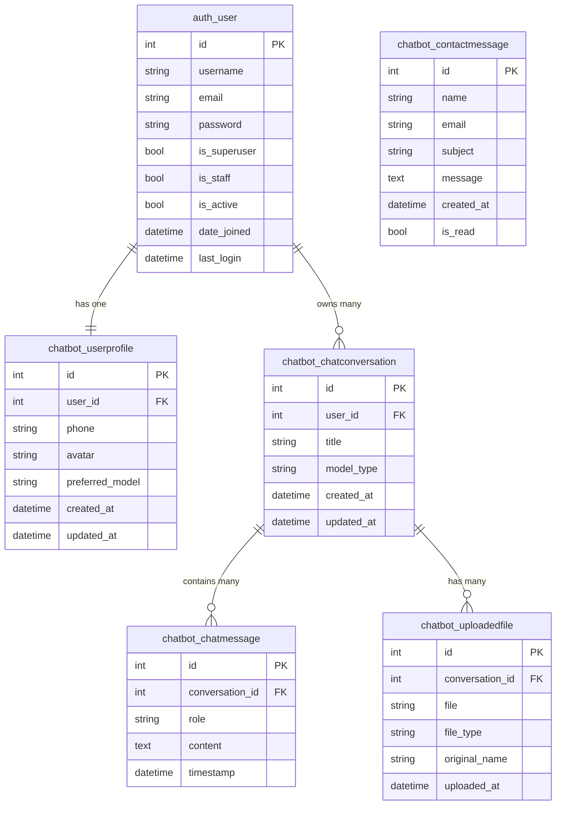

# Vitas AI — Database Schema

> **Database:** `vitas_db` (PostgreSQL 16) · **Host:** `localhost:5432` · **User:** `vitas_user`

---

## Entity Relationship Diagram



---

## Table Reference

### `auth_user` — User Accounts
| Column | Type | Description |
|---|---|---|
| `id` | `int` PK | Auto-increment primary key |
| `username` | `varchar(150)` | Unique login name |
| `email` | `varchar(254)` | Email address |
| `password` | `varchar(128)` | Hashed (never plain text) |
| `is_superuser` | `bool` | Full Django admin access |
| `is_staff` | `bool` | Can log into `/admin/` |
| `is_active` | `bool` | Account enabled/disabled |
| `date_joined` | `timestamp` | When the account was created |
| `last_login` | `timestamp` | Most recent login time |

---

### `chatbot_userprofile` — Extra Profile Info
| Column | Type | Description |
|---|---|---|
| `id` | `int` PK | Auto-increment |
| `user_id` | `int` FK → `auth_user` | Linked user (1-to-1) |
| `phone` | `varchar(15)` | Optional phone number |
| `avatar` | `varchar(100)` | Path to uploaded profile picture |
| `preferred_model` | `varchar(20)` | `medicinal` or `ayurvedic` |
| `created_at` | `timestamp` | Profile created time |
| `updated_at` | `timestamp` | Last profile update |

---

### `chatbot_chatconversation` — Chat Sessions
| Column | Type | Description |
|---|---|---|
| `id` | `int` PK | Auto-increment |
| `user_id` | `int` FK → `auth_user` | Owner of the conversation |
| `title` | `varchar(200)` | Shown in the sidebar |
| `model_type` | `varchar(20)` | `medicinal` (Gemini) or `ayurvedic` (GGUF) |
| `created_at` | `timestamp` | When the chat was started |
| `updated_at` | `timestamp` | Time of last message |

---

### `chatbot_chatmessage` — Individual Messages ⭐ Most Important
| Column | Type | Description |
|---|---|---|
| `id` | `int` PK | Auto-increment |
| `conversation_id` | `int` FK → `chatbot_chatconversation` | Which session this belongs to |
| `role` | `varchar(10)` | `user` = human, `assistant` = AI |
| `content` | `text` | The full message text |
| `timestamp` | `timestamp` | When the message was sent |

---

### `chatbot_uploadedfile` — User File Uploads
| Column | Type | Description |
|---|---|---|
| `id` | `int` PK | Auto-increment |
| `conversation_id` | `int` FK → `chatbot_chatconversation` | Which chat the file was attached to |
| `file` | `varchar(100)` | Path under `media/uploads/` |
| `file_type` | `varchar(100)` | MIME type (e.g. `image/png`) |
| `original_name` | `varchar(255)` | Original filename from user's device |
| `uploaded_at` | `timestamp` | Upload time |

---

### `chatbot_contactmessage` — Homepage Contact Form
| Column | Type | Description |
|---|---|---|
| `id` | `int` PK | Auto-increment |
| `name` | `varchar(100)` | Sender's name |
| `email` | `varchar(254)` | Sender's email |
| `subject` | `varchar(200)` | Message subject |
| `message` | `text` | Full message body |
| `created_at` | `timestamp` | When submitted |
| `is_read` | `bool` | Whether you've reviewed it |

---

## Quick SQL Cheatsheet (paste in Postico → SQL Query)

```sql
-- See all users
SELECT id, username, email, date_joined FROM auth_user;

-- See all conversations with message count
SELECT c.id, u.username, c.title, c.model_type, c.updated_at,
       COUNT(m.id) AS message_count
FROM chatbot_chatconversation c
JOIN auth_user u ON c.user_id = u.id
LEFT JOIN chatbot_chatmessage m ON m.conversation_id = c.id
GROUP BY c.id, u.username
ORDER BY c.updated_at DESC;

-- See full chat history for a specific conversation (change ID)
SELECT role, content, timestamp
FROM chatbot_chatmessage
WHERE conversation_id = 1
ORDER BY timestamp;

-- See unread contact messages
SELECT name, email, subject, created_at
FROM chatbot_contactmessage
WHERE is_read = FALSE
ORDER BY created_at DESC;
```
